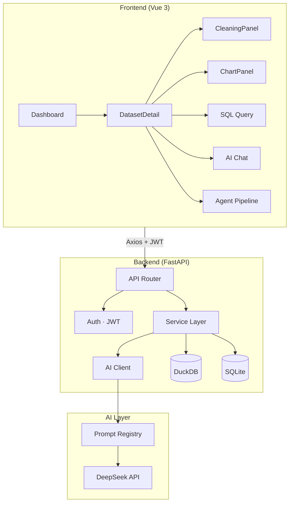

# DataPilot — AI 驱动的数据分析平台

上传 CSV/Excel，一键完成数据清洗、图表生成、SQL 查询和分析报告。**零代码、端到端、AI 原生。**


## 演示路径（5 分钟走完）

```
上传 CSV → AI 清洗数据 → AI 推荐图表 → 自然语言查询 → 一键分析 → 导出 PDF 报告
```

## 技术栈

| 层 | 技术 |
|---|---|
| 后端 | Python FastAPI + DuckDB（列式分析）+ SQLite（元数据） |
| AI | DeepSeek API · Prompt Registry（8 个模板）· BaseLLMClient 抽象 |
| 前端 | Vue 3 + Element Plus + ECharts + Pinia + mitt Event Bus |
| 部署 | Docker Compose + Nginx 反向代理 |

## 快速开始

```bash
# 1. 克隆并配置
git clone https://github.com/yourname/datapilot.git
cd datapilot
cp .env.example .env   # 填入 DEEPSEEK_API_KEY + JWT_SECRET

# 2. 开发模式（推荐调试）
cd backend && pip install -r requirements.txt
python -m uvicorn app.main:app --host 0.0.0.0 --port 8000 --reload
# 新终端
cd frontend && npm install && npm run dev
# → http://localhost:5173

# 3. Docker 部署（生产）
docker-compose up -d
# → http://localhost
```

## 架构



## 后端三层

```
api/  → 参数校验 + 统一响应 {"code":0, "data":..., "message":"ok"}
service/ → 业务逻辑
data/ → DuckDB + 文件存储
```

## 功能

| 功能 | 说明 | 状态 |
|---|---|---|
| 数据上传 | CSV/Excel，自动编码检测，DuckDB 持久化 | ✅ |
| AI 数据清洗 | 9 种安全操作（货币清理/数字提取/去重/异常值等），支持撤销 | ✅ |
| 图表推荐 | 6 维数据画像（聚合/时序/散点/直方图/相关性/极值）→ AI 推荐图表 | ✅ |
| SQL 查询 | 自然语言 + 手写 SQL 双模式，AI 解释查询结果 | ✅ |
| AI 对话 | 带数据上下文的对话，AI 自动执行 SQL 并内嵌结果表格 | ✅ |
| 一键分析 | Agent 流水线：画像→清洗→图表→洞察→报告，异步进度追踪 | ✅ |
| 报告 + PDF | AI 生成结构化报告（文字 + ECharts 图表混排），Playwright 导出 A4 PDF | ✅ |
| 数据版本 | 操作前自动快照，支持回滚撤销 | ✅ |
| 用户权限 | JWT 认证 + RBAC（admin/user），数据集按用户隔离 | ✅ |
| 操作历史 | 所有关键操作记录，支持按类型筛选 | ✅ |
| 数据血缘 | 后端记录数据变换链，追踪每一步操作 | ✅ |

## 项目结构

```
backend/app/
├── main.py              FastAPI 入口 + CORS + 全局异常处理
├── ai/                  BaseLLMClient 抽象 + DeepSeek 实现
├── api/                 12 个路由模块（薄层，只做校验+调service）
├── service/             11 个业务服务（dataset/chart/cleaning/agent/report...）
├── data/                DuckDB 管理器 + 文件存储
├── prompts/             8 个 Prompt 模板 + 管理器
├── middleware/           JWT 认证中间件
├── model/               Pydantic 数据模型
└── utils/               文件解析 + 统一响应

frontend/src/
├── views/               7 个页面（Dashboard/DatasetDetail/Reports/History/Login/Upload/Users）
├── components/          4 个通用组件（ChartPanel/DataTable/CleaningPanel/TaskProgress）
├── stores/              5 个 Pinia Store（auth/dataset/cleaning/chart/eventBus）
├── api/                 15 个 API 模块（每个对应后端一组路由）
├── composables/         ECharts 生命周期封装
└── router/              路由 + 鉴权守卫
```

## 设计决策

- **Prompt 与代码分离** — 所有 AI 提示词从代码提取到 `prompts/*.txt`，改 Prompt 不需要改代码
- **LLM Adapter 抽象** — `BaseLLMClient` 接口，更换模型只需实现一个子类
- **AI 清洗不用 AI 生成 SQL** — 9 种操作是预定义的 Python 实现，AI 只负责诊断问题和管理操作
- **Event Bus 解耦** — mitt 驱动跨组件通信（清洗完成→刷新表格），避免组件间直接调用
- **版本快照而非内存备份** — 每次清洗前 DuckDB 文件快照，撤销 = 文件级回滚

## 测试

```bash
cd backend
pytest tests/ -v
```

## License

MIT
